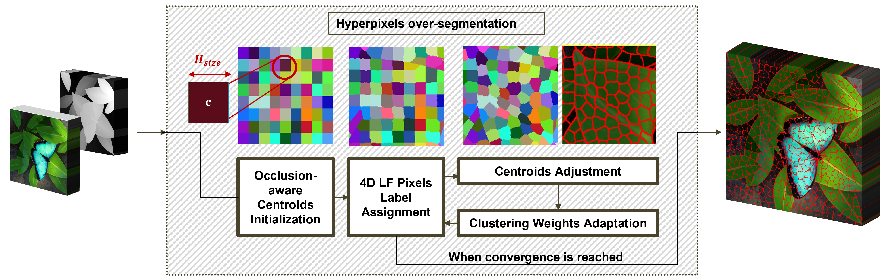

# Hyperpixels: Flexible 4D Over-segmentation for Dense and Sparse Light Fields
[Maryam Hamad](https://www.it.pt/Members/Index/29930)1,2, 
[Caroline Conti](https://www.it.pt/Members/Index/4506)1,2,
[Paulo Nunes](https://www.it.pt/Members/Index/457)1,2
[Luís Ducla Soares](https://www.it.pt/Members/Index/511)1,2 
1Instituto Universitário de Lisboa (ISCTE-IUL), 2Instituto de Telecomunicações  
 
Published in IEEE Transactions on Image Processing: 
 [Link to our paper](https://ieeexplore.ieee.org/document/10173755) 
 

 
#####  The main steps of the proposed 4D LF over-segmentation method. Given a 4D LF and the corresponding disparity maps for all views, initial centroids characterized by distinct features are assigned in the reference view/views. Next, hyperpixels are generated by iteratively applying 4D K-means clustering, including pixel labeling, centroids adjustment and clustering weights adaptation, until convergence is reached.
 

## The generated 4D light field dataset can be found in our group website:
[Link to our IT-4DLF dataset](http://www.img.lx.it.pt/IT-4DLF/) 
 
##### If you use this dataset in your work, please cite our paper: 
M. Hamad, C. Conti, P. Nunes and L. D. Soares, "Hyperpixels: Flexible 4D Over-segmentation for Dense and Sparse Light Fields," in IEEE Transactions on Image Processing, doi: 10.1109/TIP.2023.3290523.
 
## The dynamic results videos can be found in  this repository: 
[Link to the dynamic results](https://github.com/MaryamHamad/Hyperpixels/tree/main/Dynamic%20results) 

 

